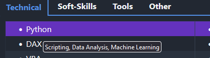

# About Me

I have a deep passion for technology, data, and coding, and thrive in environments where I can continuously learn, teach, and innovate. Among my colleagues, I am known for my dedication, approachable nature, and commitment to refining my skills—especially in areas like data analysis, automation, and problem-solving. I enjoy exploring data and transforming my knowledge into actionable insights and finding efficient solutions to routine tasks.

Currently, I'm expanding my knowledge in Linux, the Metasploit framework, and Selenium automation, which complement my skills and deepen my technical expertise.

I am originally from the South Coast of England near Brighton and in 2008, I relocated to Whistler, BC, to follow my passion for snowboarding. I proudly became a Canadian citizen in 2015. 

Explore my skills and interests below to see how I can add value to data-driven roles.

:::{admonition} My skills and interests in the below grids each have on-hover tooltips for more detail (click dropdown below for an example).
:class: tip, dropdown
  
:::

::::{tab-set}
:::{tab-item} Skills

````{tab-set}
```{tab-item} Technical
<style>
  .skills-grid {
    width: 100%;
    border-collapse: collapse;
  }
  .skills-grid td {
    width: 50%;
    padding-left: 20px;
    vertical-align: top;
  }
  .skills-grid ul {
    list-style-type: disc;
    margin: 0;
    padding-left: 20px; /* Indent for bullet points */
  }
</style>

<table class="skills-grid">
  <tr>
    <td>
      <ul>
        <li><span title="Scripting, Data Analysis, Machine Learning">Python</span></li>
      </ul>
    </td>
    <td>
      <ul>
        <li><span title="DML, DDL, TCL, Pivoting, Query Optimization using Execution Plans">SQL</span></li>
      </ul>
    </td>
  </tr>
  <tr>
    <td>
      <ul>
        <li><span title="Advanced Data Analytics, Measures, Calculated Columns, Relationship Modelling">DAX</span></li>
      </ul>
    </td>
    <td>
      <ul>
        <li><span title="Data Type Manipulation, Query Folding Optimization, Multi-Data Source Combining">M-Language</span></li>
      </ul>
    </td>
  </tr>
  <tr>
    <td>
      <ul>
        <li><span title="Scripting Automation">VBA</span></li>
      </ul>
    </td>
    <td>
      <ul>
        <li><span title="Developed , queried and maintained cubes. Created SSIS packages, as well as scripts to ETL via Python. Generated reports via SSRS">SSAS / SSIS / SSRS</span></li>
      </ul>
    </td>
  </tr>
   <tr>
    <td>
      <ul>
        <li><span title="Practical application of supervised regression and classification models ">Machine Learning</span></li>
      </ul>
    </td>
    <td>
      <ul>
        <li><span title="Good at understanding business needs from end users and creating technical documentation from them">Requirements Documentation</span></li>
      </ul>
    </td>
  </tr>
  <tr>
    <td>
      <ul>
        <li><span title="Attend weekly Data Managment Committes and discuss issues and solutions">Data Management</span></li>
      </ul>
    </td>
    <td>
      <ul>
        <li><span title="Practical use of designing OLTP / OLAP databases / Cubes, understanding of Kimball Data Warehousing, Dimension / Fact creation ">Data Modelling Experience</span></li>
      </ul>
    </td>
  </tr>
   <tr>
    <td>
      <ul>
        <li><span title="Designing and implementing key performance indicators to track business performance, identify trends, and drive decision-making ">KPI Development</span></li>
      </ul>
    </td>
    <td>
      <ul>
        <li><span title="Held roles within Tech Support 1/2 as well as providing on-going support to users of my dashboards and reports">Technical Support</span></li>
      </ul>
    </td>
   </tr>
</table>

```

```{tab-item} Soft-Skills
<table class="skills-grid">
  <tr>
    <td>
      <ul>
        <li><span title="Able to convey complex technical information to non-technical stakeholders through reports, presentations, and visualizations">Excellent Communication</span></li>
      </ul>
    </td>
    <td>
      <ul>
        <li><span title="Approach challenges methodically to find data driven solutions">Problem Solver</span></li>
      </ul>
    </td>
  </tr>
  <tr>
    <td>
      <ul>
        <li><span title="Open to change and always looking for new ways to work">Adaptability</span></li>
      </ul>
    </td>
    <td>
      <ul>
        <li><span title="Proven track record in achieving and exceeding sales targets through strategic client engagement, relationship-building, and consultative selling in a regulated environment.">Sales</span></li>
      </ul>
    </td>
  </tr>
  <tr>
    <td>
      <ul>
        <li><span title="Able to prioritize tasks to meet deadlines effectively">Time Management</span></li>
      </ul>
    </td>
    <td>
      <ul>
        <li><span title="Always open to constructive criticism and knowledge sharing">Trainable</span></li>
      </ul>
    </td>
  </tr>
</table>
```

```{tab-item} Tools

<table class="skills-grid">
  <tr>
    <td>
      <ul>
        <li><span title="Used for machine learning, exploratory data analysis, regulatory reporting and Github integration">Jupyter Lab</span></li>
      </ul>
    </td>
    <td>
      <ul>
        <li><span title="Able to create dynamic solutions with run-time variables, temp tables, CTEs, linked server queries, pivot tables and more">Microsoft SQL Server / Oracle / SQLite</span></li>
      </ul>
    </td>
  </tr>
  <tr>
    <td>
      <ul>
        <li><span title="Experience with Sales Tracking as well as data analysis, mining and report generation from CRMs">SalesForce</span></li>
      </ul>
    </td>
    <td>
      <ul>
        <li><span title="Created and maintained 20+ enterprize dashboards as well as adminstering Production, QA and Development servers">Microsoft Power BI</span></li>
      </ul>
    </td>
  </tr>
  <tr>
    <td>
      <ul>
        <li><span title="The first data visulization tool I learnt. Not as much experience with it as Power BI, but still able to build effective visulizations">Tableau</span></li>
      </ul>
    </td>
    <td>
      <ul>
        <li><span title="Used for environment management to build Python based solutions">Anaconda</span></li>
      </ul>
    </td>
  </tr>
  <tr>
    <td>
      <ul>
        <li><span title="Practical use of Git / Github (push, pull, merge conflict resolution)">Git / Github</span></li>
      </ul>
    </td>
    <td>
      <ul>
        <li><span title="My main machine learning library - used for a number of projects such as fraud detection, the Titanic survivor prediction list and cheese analysis">Sci-Kit Learn</span></li>
      </ul>
    </td>
  </tr>
  <tr>
    <td>
      <ul>
        <li><span title="My most used libraries. I am comfortable with dataframes, combining data and applying functions at row level to wrangle data">Pandas / Numpy</span></li>
      </ul>
    </td>
    <td>
      <ul>
        <li><span title="I have created, hosted and maintained a number of websites">Wordpress</span></li>
      </ul>
    </td>
  </tr>
  <tr>
    <td>
      <ul>
        <li><span title="For visualizing data within Python - depending on the preference and intricacy of the chart desired">Matplotlib / Altair / Seaborn</span></li>
      </ul>
    </td>
    <td>
      <ul>
        <li><span title="Power User - comfortable with functions, VBA integration, Power Query and most importantly, knowing when Excel isn't the right tool!">Excel</span></li>
      </ul>
    </td>
   </tr>
</table>
```
```{tab-item} Other

<table class="skills-grid">
  <tr>
    <td>
      <ul>
        <li><span title="Proven track record of providing financial advice in a regulatory environment and meeting monthly sales targets">Sales Experience</span></li>
      </ul>
    </td>
    <td>
      <ul>
        <li><span title="Obtained various certificates in both Canada and the UK which enabled me to provide financial advice and planning services">Financial Advice</span></li>
      </ul>
    </td>
    </tr>
    <tr>
    <td>
      <ul>
        <li><span title="I am passionate about learning new skills and always looking for projects to put them into practice">Lifelong Learner</span></li>
      </ul>
    </td>
    <td>
      <ul>
        <li><span title="Honors student for first year of CGA">Accounting Experience</span></li>
      </ul>
    </td>
  </tr>

</table>
```

````

:::
:::{tab-item} Interests

<table class="skills-grid">
  <tr>
    <td>
      <ul>
        <li><span title="From building my own PC to a custom Raspberry Pi air quality sensor linked to a home server (via flask library in Python) - I love to build projects and play with technology!">Building Hardware</span></li>
      </ul>
    </td>
    <td>
      <ul>
        <li><span title="I enjoy developing solutions that help to automate tasks. Some of these include a Poshmark automation project, developed for my wife so that she could sell items on a social media platform- check this project out in my Examples of Work - under 'Poshmark Automation">Automation Projects</span></li>
      </ul>
    </td>
  </tr>
  <tr>
    <td>
      <ul>
        <li><span title="I love sci-fi and Some of my favourites include The Culture Series (Iain Banks) and Bobiverse (Dennis E. Taylor). I also love science based books and recently enjoyed A Universe from Nothing (Lawrence M. Krauss) and The Selfish Gene (Richard Dawkins). Another book which I recommend reading for others in the IT industry is The Phoenix Project (Gene Kim, George Spafford, and Kevin Behr)">Reading / Audiobooks</span></li>
      </ul>
    </td>
    <td>
      <ul>
        <li><span title="I listen to a lot of science and technology based podcasts suich as Into the Impossible - Brian Keating, Lex Friedman Podcast, This Week in Tech (Leo Laporte) and Security Now (Steve Gibson).">Podcasts</span></li>
      </ul>
    </td>
  </tr>
  <tr>
    <td>
      <ul>
        <li><span title="Dedicated to maintaining a regular gym routine every other day to stay fit, especially since I spend much of my time at a desk">Fitness and Health</span></li>
      </ul>
    </td>
    <td>
      <ul>
        <li><span title="I love dogs and try to get out every day for an hour long walk">Dog Walking</span></li>
      </ul>
    </td>
  </tr>
   <tr>
    <td>
      <ul>
        <li><span title="I enjoy playing online games with friends. Some of my favourites are Factorio, Escape from Tarkov, League of Legends and Barotrauma">Video Games</span></li>
      </ul>
    </td>
    <td>
      <ul>
        <li><span title="I am most satisfied when I am learning and applying new skills. I particularly enjoy setting about a new project and learning as I go">Learning and Applying New Things</span></li>
      </ul>
    </td>
  </tr>
</table>


:::
::::